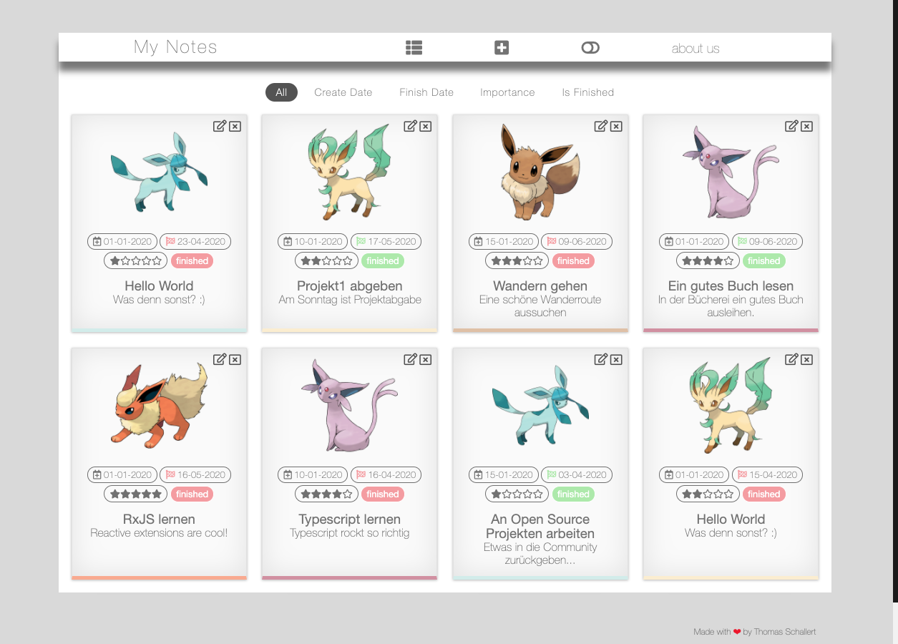
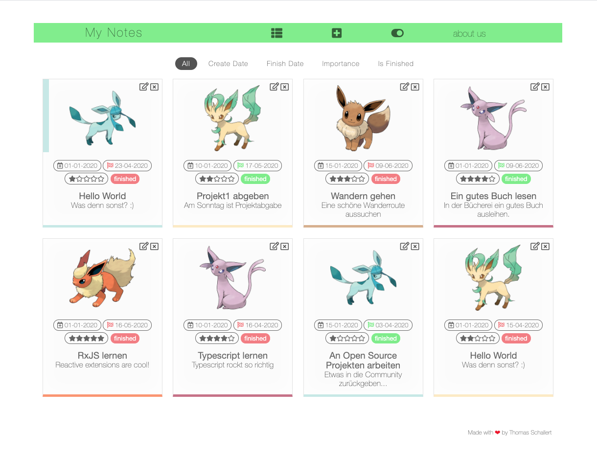

# MyNotes App (CAS-FEE-2020 Project1)

## Description

A simple notes application. The frontend is built with vanillajs and the backend with nest.js. The backend uses graphql for querying and a mongodb to save the data.

[Nest](https://github.com/nestjs/nest) framework TypeScript starter repository.

<p align="center">
  
</p>

## Features
* CRUD operations - add, show, edit and delete notes.
* Notes are colored by importance, each color has also it's own Pokémon.
* Theme toggler - switch theme design.
* Sorting by different criteria.
* Drag and drop - delete notes with drag and drop.
* Modal for creating and editing notes.
* Component based architecture.
* Router which handles rendering and most of the event handling.
* Routes for creating and editing notes.\
example-routes: http://localhost:3000/#new or http://localhost:3000/#edit/5ef4ba7fb61567f337d8eb12

## Sort notes by different criteria
* init state (All)
* create date (Create Date)
* finish date (Finish Date)
* importance (Importance)
* finished (Is Finished)

## Switch theme to another color schema

<p align="center">
  
</p>

## Installation

```bash
$ npm install
```

## Running the app

```bash
# development
$ npm run start

# watch mode
$ npm run start:dev

# production mode
$ npm run start:prod
```

## GraphQL Mutation for creating a bunch of Notes

After installing the app please go to http://localhost:3000/graphql and run the following mutation to create a bunch of notes. After that you can surfe to http://localhost:3000/ where the notes will be shown.

```
mutation {
  insertNotes{
    id,
    title,
    description,
    finishDate,
    createDate,
    importance,
    finished
  }
}
```

## GraphQL Test Queries/Mutations for Notes

You could also test the graphql api on the graphql playground with the following queries/mutations. Just visit http://localhost:3000/graphql and copy/paste the mutation/query that you want to run.

```
mutation {
  addNote(newNoteData: {
  	title: "Neue Notiz",
    description: "Ich muss heute noch viele Bücher lesen",
    finishDate: "10-10-2020",
    importance: 5,
    finished: false
  }){
    id,
    title,
    description,
    finishDate,
    createDate,
    importance,
    finished
  }
}

query {
  note(id: "5ee668915b92b0c2e0ba900f")
  {
    title,
    description,
    createDate,
    finishDate,
    importance,
    finished
  }
}

query {
  notes
  {
    id,
    title,
    description,
    finishDate,
    importance,
    finished
  }
}

mutation {
  removeNote(id: "5ee667eb2d2ee4c249288ed2")
}

mutation {
  update(updateNoteData: {
    id: "5ee668915b92b0c2e0ba900f",
  	title: "Neue Notiz",
    description: "Keine Schokolade mehr essen...",
    finishDate: "11-10-2020",
    importance: 4,
    finished: true
  }){
    id,
    title,
    description,
    finishDate,
    createDate,
    importance,
    finished
  }
}
```

## Deleting notes with drag and drop

Just drag the note that you want to delete to the left or the right side of the browser window. When you drag it, a red box appears on the right and left side of the browser window. If you drag the note over the red box, the color switches to dark red and you can drop the note - it will get deleted.  After deleting the note, the notes stay as they were before deleting. The notes get ordered new at the next action. I thought this behavior is more natural.

## Versioning

```sh
Node Version: v12.6.0
NPM Version: 6.9.0
MongoDB Version: 4.0.6 Community Edition
```

## Stay in touch

- Author - [Thomas Schallert](https://github.com/tomschall/)
